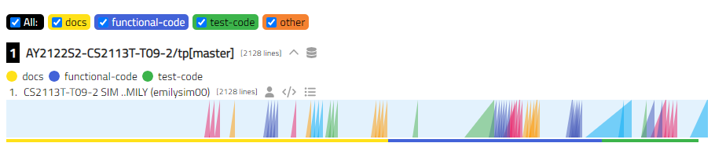
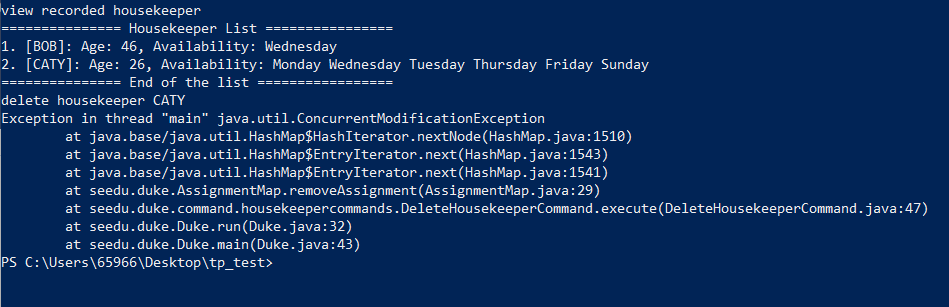

# Emily Sim - Project Portfolio Page

## Overview
This page showcases my contributions to the development of WerkIt!, a team project (tP) in the CS2113T
Software Engineering & Object-Oriented Programming module offered by the School of Computing, National University of
Singapore.

### About the Project
WerkIt! is a command line interface (CLI) application written in Java that allows users to create a weekly workout
schedule for them to refer to and follow. More details about the project can be found in the following locations:
* [GitHub Repository](https://github.com/AY2122S2-CS2113T-T09-2/tp)
* [WerkIt! User Guide](../UserGuide.md)
* [WerkIt! Developer Guide](../DeveloperGuide.md)

### Summary of Contributions
### Code Contributed
A detailed report of my code contributions to the tP can be found in the 
[tP Code Dashboard](https://nus-cs2113-ay2122s2.github.io/tp-dashboard/?search=emilysim00&breakdown=true)
hosted by the module coordinators of CS2113T.

#### Summary of my feature's code contributions 
* Implemented various WerkIt's features. A summary of these features implemented by me is stated below. 

| New Feature                                 | What it does                                                   | Justification                                                                                                                                                                                                                                                        | Main Method Implemented | Supporting Methods Implemented                   |
|---------------------------------------------|----------------------------------------------------------------|----------------------------------------------------------------------------------------------------------------------------------------------------------------------------------------------------------------------------------------------------------------------|-------------------------|--------------------------------------------------|
| View all workouts                           | Allows user to view all the workouts created by him/her.       | This feature allows the user to view all workouts stored in the workout list. They can then create a plan with these workouts.                                                                                                                                       | `listAllWorkout()`      | -                                                | 
| Add/Update a plan for a day in the schedule | Allows user to schedule a workout plan on a particular day.    | Users should be able to schedule any plans they created for a day in the 7-day workout plan schedule.    Highlights: Users are able to quickly type out the command by indicating the day in the week with integers instead of typing out the name of the day. | `updateDay()`           | `isDayValid()`   `isPlanValid()`              |
| View schedule                               | Allows user to view all the plans scheduled for the week.      | This feature allows the user to have an overview of all the plans that have been scheduled. This would allow them to determine if they would want to make modification to the schedule.                                                                              | `printSchedule()`       | `padWithSpaces()`   `convertDayNumberToDay()` |
| Remove plan scheduled on a particular day   | Allows users to remove the plan scheduled on a particular day. | This feature allows the user to change the plan scheduled on a particular day easily.    Highlights: Users are able to quickly type out the command by indicating the day in the week with integers instead of typing out the name of the day.                 | `clearPlan()`           | `isDayValid()`   `clearPlan()`                |
| Reset the 7-days workout plan schedule      | Allows user to reset his/her workout plan schedule.            | This feature allows the user to remove all plans scheduled at once, so they can plan their schedule from the start.                                                                                                                                                  | `clearAllSchedule()`    | `clearPlan()`                                    |

* Wrote the majority of the codes in `Day.java`, `ScheduleCommand.java` and `InvalidScheduleException.java`.
* Contributed to some codes in exception-related files such as `InvalidCommandException`. 
* Contributed to some parts of the `UI` such as the `printNewScheduleCreatedMessage(Day newDay)` and 
`printClearedScheduleMessage()` methods. The former method will print a successful message to indicate 
that a plan has been successfully scheduled on the day stated. While the latter method will print a successful message to indicate
that a plan has been successfully removed on the day stated. 
* Contributed parts of the `Parser` API, mainly the `createScheduleCommand()` method.

#### Enhancements to existing features
In addition, I have also written JavaDocs for all the methods stated above. Assertions are added into various
parts of the method to ensure the code works based on assumptions, such as testing the day range. Logging was added to 
the methods to capture and keep track of the events that has occurred. 

#### Summary of my Test Code contributions
Wrote JUnit test cases for WerkIt! The summary of the test cases I have written is stated in the table below. 

| Test Files               | Test Case Name                                                                                                                                                                                                                                                                     |
|--------------------------|------------------------------------------------------------------------------------------------------------------------------------------------------------------------------------------------------------------------------------------------------------------------------------|
| WorkoutListTest.java     | listWorkout_expectThreePrints()   listWorkout_expectNoPrints()                                                                                                                                                                                                                  |                    
| ScheduleCommandTest.java | setUserAction_createInvalidAction_expectInvalidCommandException()  scheduleCommand_validScheduleUpdateConstruction()   scheduleCommand_validScheduleClearConstruction()   scheduleCommand_validScheduleClearAllConstruction()                                             |                    
| DayListTest.java         | updateSchedule_expectSuccess()   updateSchedule_expectInvalidUpdate()   updateSchedule_expectSuccessPrints()   clearSchedule_expectSuccess()   clearSchedule_expectInvalidClear()   clearAllSchedule_expectSuccess()   printSchedule_expectSuccessNoPlansAdded() |

### Contributions to the User Guide (UG)
* Wrote the [Introduction and Terminology](../UserGuide.md) section in the User Guide.
* Wrote guide on [listing all workouts](../UserGuide.md#show-all-workouts-workout-list)
* Wrote guide on all the Schedule features of WerkIt:
  * [Adding/Updating a plan to a particular day](../UserGuide.md#update-schedule-schedule-update)
  * [Viewing the 7-days workout plan schedule](../UserGuide.md#view-schedule-schedule-list)
  * [Removing of a plan scheduled on a particular day](../UserGuide.md#clear-schedule-for-a-day-schedule-clear)
  * [Resetting the workout plan schedule](../UserGuide.md#clear-schedule-for-the-week-schedule-clearall)
* Wrote the informational sector of WerkIt's features
  * [Overview of the all WerkIt's features](../UserGuide.md#features)
  * [Explanation on how the different features link with one another](../UserGuide.md#features)
  * [Explanation of the command syntax for each of the features](../UserGuide.md#finding-your-way-around-the-application)
* Wrote [command summary](../UserGuide.md#command-summary) for search and schedule features.

### Contributions to the Developer Guide (DG)
* Creating the [Architecture Diagram](../DeveloperGuide.md#architecture-diagram) under the Design Section.
* Wrote the design section on [UI component](../DeveloperGuide.md#ui-component).
* Wrote the design section on [Schedule related features](../DeveloperGuide.md#schedule-related-features).
* Wrote the following contributions to the [Implementation](../DeveloperGuide.md#implementation) section:
  * [Schedule Features](../DeveloperGuide.md#schedule)
    * [How a plan is being updated/added into the schedule](../DeveloperGuide.md#update-schedule)
      * Includes sequence diagrams to visualise the process.
      * Includes the design consideration for this feature. 
    * [How to view the schedule](../DeveloperGuide.md#view-schedule)
      * Includes sequence diagrams to visualise the process.
    * [How to remove a scheduled workout plan](../DeveloperGuide.md#clear-schedule-for-a-day)
      * Includes sequence diagrams to visualise the process.
    * [How to reset the workout plan schedule](../DeveloperGuide.md#clear-schedule-for-the-week)
      * Includes sequence diagrams to visualise the process.
* Wrote part of [user stories](../DeveloperGuide.md#user-stories).
* Wrote part of [manual testing instructions](../DeveloperGuide.md#test-on-schedule-features).
* Wrote the [non-functional requirements](../DeveloperGuide.md#non-functional-requirements) section. 

### Contributions to Team-Based Tasks
- Helped in release management of WerkIt! (for v1.0 and v2.0)

### Review/Mentoring Contributions
Reviewed teammates' pull requests, including (but not limited to):
* Review 1: [Suggests teammate on the naming convention in DG](https://github.com/AY2122S2-CS2113T-T09-2/tp/pull/240)
* Review 2: [Reviewed teammate's PPP write up and suggested improvements to consider](https://github.com/AY2122S2-CS2113T-T09-2/tp/pull/239)
* Review 3: [Reviewed and gave suggestions on sequence diagram](https://github.com/AY2122S2-CS2113T-T09-2/tp/pull/220)

Bugs captured, including (but not limited to):
* Spotted a bug on `schedule /clear` and `schedule /clearall` features. 
More details on the bug can be viewed in this [issue](https://github.com/AY2122S2-CS2113T-T09-2/tp/issues/165).
* Spotted a bug on `plan /delete` feature. 
More details on the bug can be viewed in this [issue](https://github.com/AY2122S2-CS2113T-T09-2/tp/issues/170).

### Community
* Provided feedback and potential bug reports to another team's project 
[(CS2113T-T11-1's HotelLite Manager)](https://ay2122s2-cs2113-t11-1.github.io/tp/UserGuide.html) 
as part of the Practical Exam Dry-Run (PED). 
  * Screenshot of one of the high severity bugs reported 
  The application is unable to remove the housekeeper if they are being assigned to a hotel room. The program get terminated
  straight without proper exception handling. 
  Click [here](https://github.com/emilysim00/ped/issues/8) to view the issues in GitHub.

  * Another high severity bug reported is on the file management of one of its feature. To find out more details on this 
  bug, click [here](https://github.com/emilysim00/ped/issues/10).

  More reported bugs can be found [here](https://github.com/emilysim00/ped/issues)

* Suggested and reviewed other team's Developer Guide 
  * [Reviewed Group T10-2](https://github.com/nus-cs2113-AY2122S2/tp/pull/7/files/ff6fa7904a5c27a8aeb91b493c812265453b7dda)