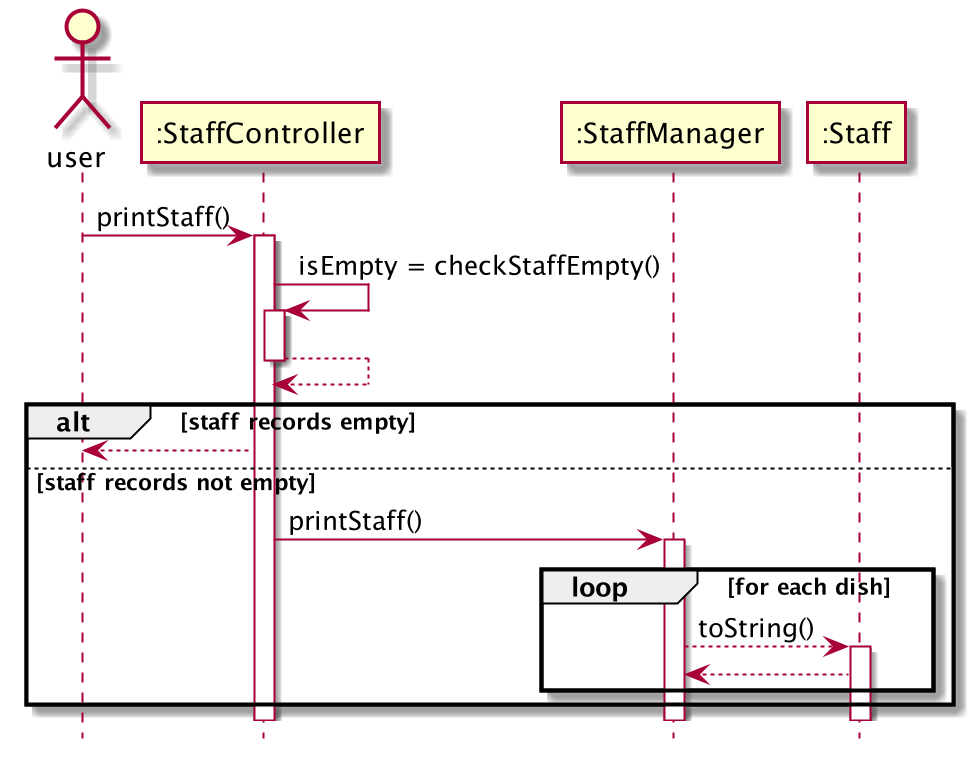

# Lim Shi Han - Project Portfolio Page

## Overview

Hello, my name is Shi Han!

Welcome to my PPP:)

## Summary of Contributions

#### Code contribution
  - My code contribution to the team project can be viewed using this link: https://nus-cs2113-ay2122s2.github.io/tp-dashboard/?search=lim-shi-han&breakdown=true
#### Enhancements implemeted
  - Implemented staff functionalities in the application, which includes:
    - `printStaff()` -- print all staffs.
    - `addStaff(int staffId, String staffName, String position, double salary)` -- add a new staff with the arguments as its attributes.
    - `findByStaffId(int staffId)` -- find a staff using staff id.
    - `deleteByStaffId(int staffId)` -- delete a staff using staff id.
    - `editStaff()` -- change attribute of a staff using staff id.
  - Assisted in the design and implementation of the project.
  - Created JUnit tests to test staff functionalities to ensure good coverage for `StaffManager` and `Staff` classes.
  - Made minor changes in teammates' code.
#### Contributions to UG
  - Documented for staff functionalities.
  - Contributed to the overall formatting of the UG to make it more standardised.
#### Contributions to DG
  - Documented for staff functionalities.
  - Created 5 UML sequence diagrams for staff functionalities, an example of which (`printStaff`) is attached below:
    
  - Contributed to the overall UML class diagram attached below:
    
#### Contributions to team-based tasks
  - Setting up the Github team organisation and repository.
  - Maintaining issue tracker and milestones in order to ensure timely completion of tasks.
#### Review/mentoring contributions
  - Helped to review and comment on pull requests made by teammates, links to some examples provided below:
    - https://github.com/AY2122S2-CS2113-T11-4/tp/pull/54
    - https://github.com/AY2122S2-CS2113-T11-4/tp/pull/23
    - https://github.com/AY2122S2-CS2113-T11-4/tp/pull/61
#### Contributions beyond the team project
  - Provided and above average number of reviews for other team and individual projects, with links to examples provided below:
    - https://github.com/nus-cs2113-AY2122S2/ip/pull/18
    - https://github.com/Lim-Shi-Han/ped/issues
