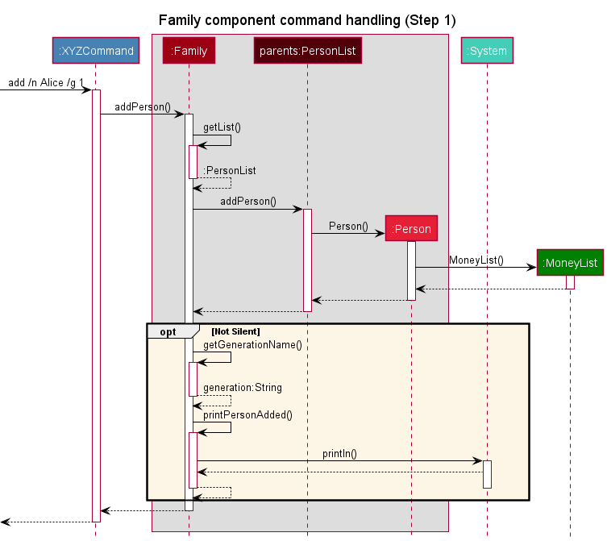
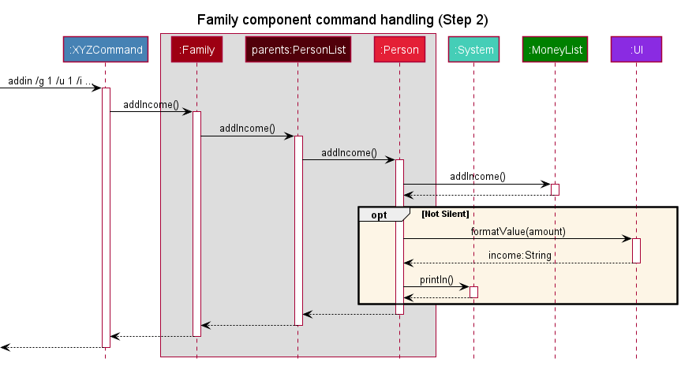
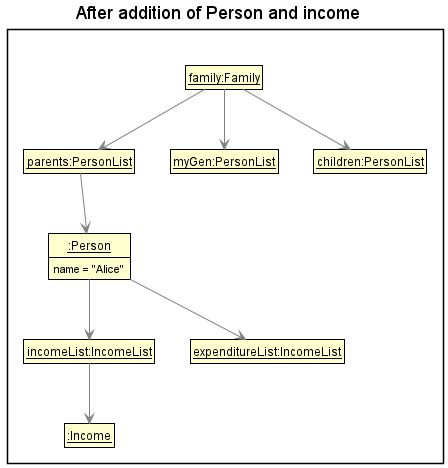
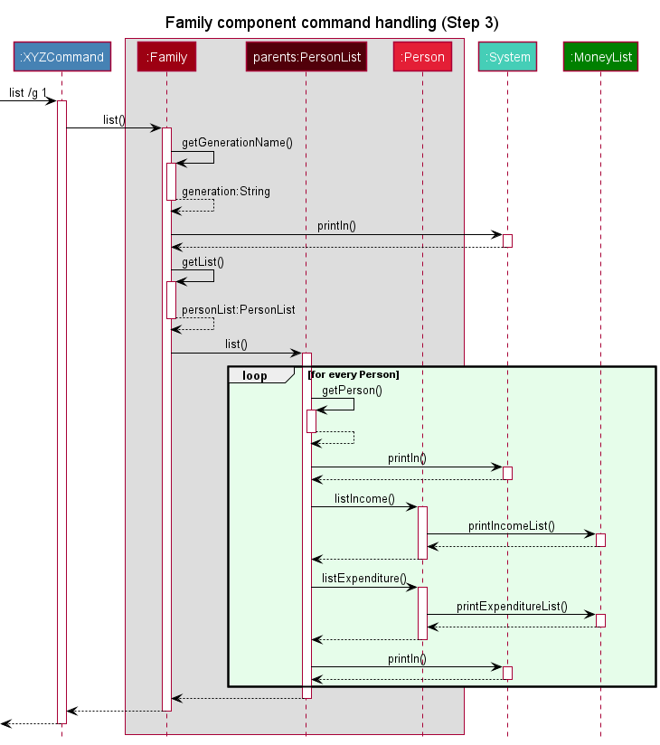
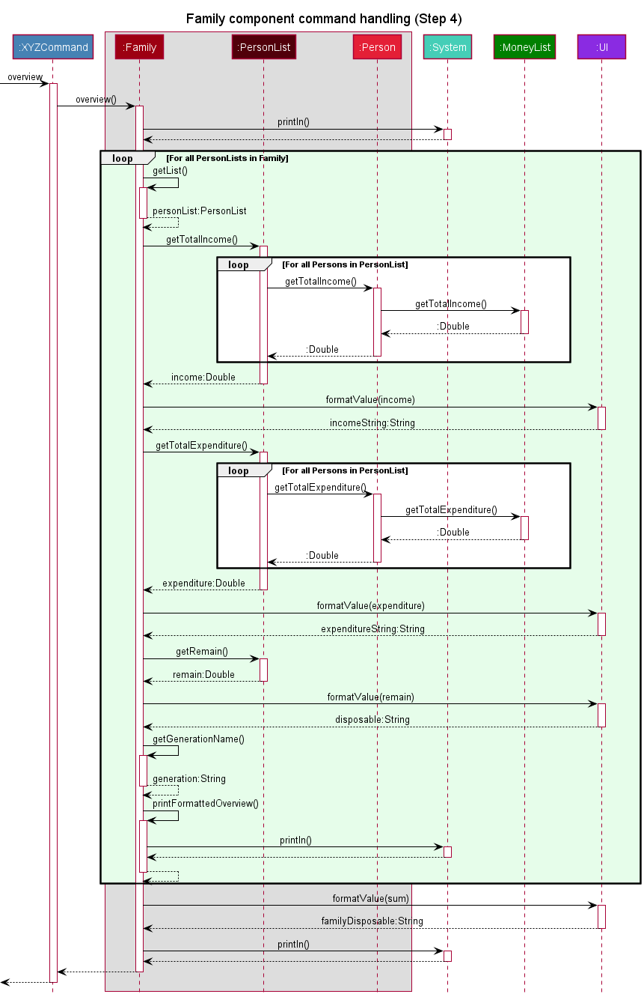

# Tean Wei Jun - Project Portfolio Page

## Project: PlanITarium

PlanITarium is an application that assists you and your family in managing your finances, optimized for use on the
Command Line Interface (CLI). You can use it to view your monthly financial status, logically group family members for
better management, and categorise your expenditures. PlanITarium is written in, and meant to be run on `Java 11`.

## Summary of Contributions

### Code contribution

[RepoSense link](https://nus-cs2113-ay2122s2.github.io/tp-dashboard/?search=&sort=groupTitle&sortWithin=title&timeframe=commit&mergegroup=&groupSelect=groupByRepos&breakdown=true&checkedFileTypes=docs~functional-code~test-code~other&since=2022-02-18&tabOpen=true&tabType=authorship&tabAuthor=teanweijun&tabRepo=AY2122S2-CS2113T-T10-2%2Ftp%5Bmaster%5D&authorshipIsMergeGroup=false&authorshipFileTypes=docs~functional-code~test-code~other&authorshipIsBinaryFileTypeChecked=false)

### Enhancements implemented

* **New Feature**: Added Family component to act as bridge between Command and Money components
* **Aesthetics**: Implemented most of the UI and what is shown to the user on commands
* **Code defensiveness**: Implemented a logger to log the execution of PlanITarium
* **Code defensiveness**: Wrote JUnit tests for the Family component and for formatValue() in UI

### User Guide contribution

* Created command summary seen [here](https://ay2122s2-cs2113t-t10-2.github.io/tp/UserGuide.html#command-summary)
* Fix most grammatical errors and language use 
* Standardised the format of UG factors such as order of parameters in usage examples and their description
* Wrote the guide for [`overview`](https://ay2122s2-cs2113t-t10-2.github.io/tp/UserGuide.html#show-financial-summary-overview),
[`list`](https://ay2122s2-cs2113t-t10-2.github.io/tp/UserGuide.html#show-all-records-by-group-list) and 
[`find`](https://ay2122s2-cs2113t-t10-2.github.io/tp/UserGuide.html#searching-for-details-find) commands

### Developer Guide contribution

* Wrote the [Family component](https://ay2122s2-cs2113t-t10-2.github.io/tp/DeveloperGuide.html#family-component)
* Added every UML diagram under Family component
* Wrote the [Non-functional requirements](https://ay2122s2-cs2113t-t10-2.github.io/tp/DeveloperGuide.html#non-functional-requirements)
* Wrote the documentation for [Logging](https://ay2122s2-cs2113t-t10-2.github.io/tp/DeveloperGuide.html#logging)
* Wrote the documentation for [Testing](https://ay2122s2-cs2113t-t10-2.github.io/tp/DeveloperGuide.html#testing)
* Wrote the documentation for [Manual testing](https://ay2122s2-cs2113t-t10-2.github.io/tp/DeveloperGuide.html#instructions-for-manual-testing),
with the exception of `Loading data`

### Team-Based tasks contribution

* Set up the team GitHub org/repo
* Helping to tag teammate's PR to the relevant milestones
* Finalised and released `v1.0` on GitHub during a team meeting
* Finalised and released `v2.1` on GitHub during a team meeting
* Coming up with a to-do list every team meeting

### Review contribution

* Many PRs reviewed, including small changes. But noticeable ones include:
  * [Pull request 23](https://github.com/AY2122S2-CS2113T-T10-2/tp/pull/23)
  * [Pull request 42](https://github.com/AY2122S2-CS2113T-T10-2/tp/pull/42)
  * [Pull request 50](https://github.com/AY2122S2-CS2113T-T10-2/tp/pull/50)
  * [Pull request 116](https://github.com/AY2122S2-CS2113T-T10-2/tp/pull/116)
  * [Pull request 167](https://github.com/AY2122S2-CS2113T-T10-2/tp/pull/167)
  * [Pull request 257](https://github.com/AY2122S2-CS2113T-T10-2/tp/pull/257)

### Beyond team contribution

* Above average bugs reported in iP PR peer review
* Above average bugs found in PE-D
* Assisted in solving issues posted on [forums](https://github.com/nus-cs2113-AY2122S2/forum/issues/65)

## Reproduced documentation contribution

Intra-document links (links to another section of the document) will not be working in this section.

### Reproduced [User Guide](../UserGuide.md) contribution

#### Show financial summary: `overview`

> Shows a summary of the total income, expenditure and disposable income of each group.

Format: `overview`

#### Show all records by group: `list`

> Shows a list of incomes and expenditures for each person in a given group.

Format: `list /g GROUP_INDEX`

* **GROUP_INDEX** refers to the index of the group that you belong to.

Example of usage:

* List all the members from Parents' group.

  `list /g 1`

  

#### Searching for details: `find`

> Search for a string as provided by you throughout all your income and expenditure.

Format: `find /d USER_STRING [/c CATEGORY_INDEX]`

* **USER_STRING** refers to the keyword which you want to look for.
* **CATEGORY_INDEX** refers to the category of your expenditure.

> :information_source: Notes:
> * Keywords are case-sensitive and inclusive. So a search for `brush` will successfully look for `toothbrush`.
> * If you want to search for expenditures in all categories instead of specific ones, omit **CATEGORY_INDEX**.
> * While searching through incomes, PlanITarium ignores the **CATEGORY_INDEX** provided.

Example of usage:

Find records with category:

* Find all the records which descriptions include _candies_ from Category 1.

  `find /d candies /c 1`

* _Result_: The result of the search is returned and printed to the screen.

  

Find records without category:

* Find all the records which descriptions include _candies_.

  `find /d candies`

* _Result_:

  

#### Command Summary

To keep things simple, we will omit the parameter description for you. To view each command in detail, refer to
the [features](#features) section.

| Command                                                                     | Format                                                                                                                                                              |
|-----------------------------------------------------------------------------|---------------------------------------------------------------------------------------------------------------------------------------------------------------------|
| [View all commands](#viewing-all-commands-codehelpcode)                     | help                                                                                                                                                                |
| [Add a person](#add-a-person-codeaddcode)                                   | add /n __ /g __  e.g.  `> add /n Alice /g 1`                                                                                                                |
| [Delete a person](#delete-a-person-codedeletecode)                          | delete /g __ /u __  e.g.  `> delete /g 1 /u 2`                                                                                                              |
| [Add an income](#add-an-income-codeaddincode)                               | addin /g__ /u __ /i __ /d __ /p __  e.g.  `> addin /g 2 /u 3 /i 2000 /d salary /p t`                                                                        |
| [Delete an income](#delete-an-income-codedeleteincode)                      | deletein /g __ /u __ /r __  e.g.  `> deletein /g 2 /u 1 /r 5`                                                                                               |
| [Edit an income](#edit-an-income-codeeditincode)                            | editin /g __ /u __ /r __ [ /i __ /d __ /p __ ]  e.g.  `> editin /g 3 /u 1 /r 5 /i 10 /d stationary`   `> editin /g 2 /u 4 /r 1 /d red pack /p f`        |
| [Add an expenditure](#add-an-expenditure-codeaddoutcode)                    | addout /g__ /u __ /e __ /d __ /c __ /p __  e.g.  `> addout /g 2 /u 3 /e 400 /d books /c 1 /p f`                                                             |
| [Delete an expenditure](#delete-an-expenditure-codedeleteoutcode)           | deleteout /g __ /u __ /r __  e.g.  `> deleteout /g 2 /u 1 /r 1`                                                                                             |
| [Edit an expenditure](#edit-an-expenditure-codeeditoutcode)                 | editout /g __ /u __ /r __ [ /e __ /d __ /c __ /p __ ]  e.g.  `> editout /g 2 /u 1 /r 2 /e 400 /d dinner /c 3`   `> editout /g 1 /u 2 /r 6 /d misc /p t` |
| [Show financial summary](#show-financial-summary-codeoverviewcode)          | overview                                                                                                                                                            |
| [Show all records by group](#show-all-records-by-group-codelistcode)        | list /g __  e.g.  `> list /g 1`                                                                                                                             | 
| [Show expenditure categories](#show-expenditure-categories-codelistcatcode) | listcat                                                                                                                                                             |
| [Searching for details](#searching-for-details-codefindcode)                | find /d __ [ /c __ ]  e.g.  `> find salary`   `> find sugar /c 4`                                                                                       |
| [Exit the program](#exit-codebyecode)                                       | bye                                                                                                                                                                 |

### Reproduced [Developer Guide](../DeveloperGuide) contribution

#### Family Component

The `Family` component consists of the following classes: [`Family.java`](
https://github.com/AY2122S2-CS2113T-T10-2/tp/blob/master/src/main/java/seedu/planitarium/person/Family.java)
, [`PersonList.java`](
https://github.com/AY2122S2-CS2113T-T10-2/tp/blob/master/src/main/java/seedu/planitarium/person/PersonList.java)
and [`Person.java`](
https://github.com/AY2122S2-CS2113T-T10-2/tp/blob/master/src/main/java/seedu/planitarium/person/Person.java)

The `Family` component is implemented in an n-level architecture. It stores the logical grouping of persons added i.e.,
all `Person` objects must belong to one of the `PersonList`, with all `PersonList` belonging under one `Family`.
It also depends on the `Money` component to help keep track of each `Person`'s income and expenditure as each `Person`
contains an `IncomeList` and `ExpenditureList`.

The Class Diagram below shows the full structure of the `Family` component and the components it interacts with.

The three generational `PersonList` under `Family` are `parents`, `myGen` and `children`.

How the `Family` component is used:

1. Upon input from the user, the user is passed through the `Command` component and a corresponding method is called from
   the `Family` class.
2. Depending on the level which the command executes on, each command is passed top-down until it arrives at the relevant
   level for execution.
3. If the command requires operations on the `Money` components, the command is further passed down to the `Money`
   component for execution.
4. It is also responsible most of the printing to the user interface. The n-level implementation allows for effective
   wrapping and indentation of lines printed.

To aid in visualisation,

* Methods on `IncomeList` and `ExpenditureList` will be simplified to call to `MoneyList`.
* The following situation will be simulated:
    1. User adds a Person, *Alice* to `parents`
    2. User adds an income to *Alice*
    3. User decides to view the `parents` generation in detail
    4. User decides to view the overall situation in the `Family`

The following Sequence Diagrams shows how the `Family` component handles each call by the `Command` component.

Step 1. User adds a Person, *Alice* to `parents`

Step 2. User adds an income to *Alice*

Additionally, the following Object Diagram shows what is present in the `Family` structure at this point in time.

Step 3. User decides to view the `parents` generation in detail

Step 4. User decides to view the overall situation in the `Family`.

#### Logging

The logging of this product is facilitated by [`ProjectLogger.java`](
https://github.com/AY2122S2-CS2113T-T10-2/tp/blob/master/src/main/java/seedu/planitarium/ProjectLogger.java).

Each class contains a static `logger` which logs information and errors through all instances of the class in a single
log file. The log files are named after the class, an example being `Family.log` for the `Family` class.

Simple logging is used as it provides sufficient information for documentation and debugging purposes. The log files
are rewritten during every run of PlanITarium, so renaming of the old logs are necessary should it need to be saved.

#### Testing

PlanITarium is tested mainly in 2 ways:
* JUnit testing
* IO redirection testing

##### JUnit testing

JUnit testing can be performed by running the tests in the [`test`](
https://github.com/AY2122S2-CS2113T-T10-2/tp/blob/master/src/test/java/seedu/planitarium) folder.

##### IO redirection testing

IO redirection testing can be performed via the following steps:
1. Launch a terminal in `tp/text-ui-test`
2. Edit the input file `input.txt`, and the expected output `EXPECTED.txt` if necessary
3. Run the file `runtest.bat` in the terminal

#### Non-Functional Requirements

1. A user with above average typing speed for regular English text (i.e. not code, not system admin commands) should be
   able to accomplish most of the tasks faster using commands than using the mouse.
2. The product be able to hold up to 100 entries without a noticeable sluggishness in performance for typical usage.
3. The product should be for a single user i.e. (not a multi-user product).
4. The data should be stored locally and should be in a human editable text file.
5. The data should not be stored with a database management system.
6. The product should work on the Windows, Linux and OS-X platforms.
7. The product should work on a computer that has version 11 of Java installed.
8. The product should work without requiring an installer.
9. The product should not depend on a remote server.
10. The product must be packaged into a single JAR file.
11. Size of product should be less than 100MB, size of documents should be less than 15MB per file.

#### Instructions for Manual Testing

Given below are instructions to test the app manually.

> :information_source: **Note:** These instructions only provide a starting point for testers to work on; testers are
> expected to do more *exploratory* testing.

##### Initial launch

1. Download the jar file from [here](https://github.com/AY2122S2-CS2113T-T10-2/tp/releases) and copy it into an empty folder.
2. Open a terminal in the folder and run `java -jar PlanITarium.jar`. Expected: Shows the welcome message.

##### Shutdown

Upon request for input, type `bye` and press [Enter].

##### Adding persons

1. Use the `overview` command to view the groups available.
2. Test case: `add /g 1 /n Alice`  
   Expected: Alice is added to the `Parents` group. Upon `list /g 1`, Alice can be seen under `Parents`.
3. Test case: `add /g 0 /n Bob`  
   Expected: Bob is not added. Error details shown in the error message.

##### Deleting persons

1. Use the `list` command on the group which a person should be deleted from.
2. Prerequisite: At least 1 person in the group.
3. Test case: `delete /g 1 /u 1`  
   Expected: First person is deleted from the `Parents` group. Upon `list /g 1`, other persons have their index decremented.
4. Test case: `delete /g 0 /u 1`  
   Expected: No person is deleted. Error details shown in the error message.
5. Other incorrect delete commands to try: `delete`, `delete /g 1`, `delete /g 1 /u 0`, `delete /g x /u y` (where y is larger
   than the number of members in group x)  
   Expected: Similar to previous.

##### Adding incomes

###### Adding a non-recurring income
1. Prerequisite: The person in which the income will be added to exist, then use the `list` command on the group
   which the person resides in to get his user index.
2. Test case: `addin /g 1 /u 1 /d Donations /i 6000 /p f`  
   Expected: A non-recurring income entry worth $6000 from Donations is added to the first person of `Parents`.
3. Test case: `addin /g 1 /u 1 /d Donations /i 6000.123 /p f`  
   Expected: No income is added. Error details shown in the error message.
4. Other incorrect addin commands to try: `addin`, `addin /g 1 /u 1 /d Test case /i notDouble /p f`  
   Expected: Similar to previous.

###### Adding a recurring income
1. Prerequisite: Similar to previous.
2. Testing similar to previous, but with `/p t` instead.

##### Adding expenditures

###### Adding a non-recurring expenditure
1. Prerequisite: The person in which the expenditure will be added to exist, then use the `list` command on the group
   which the person resides in to get his user index.
2. Test case: `addout /g 1 /u 1 /d Food /e 50 /c 2 /p f`  
   Expected: A non-recurring expenditure entry worth $50 for Food, in the category *Food and Drinks*, is added to
   the first person of `Parents`.
3. Test case: `addout /g 1 /u 1 /d Food /e 50 /c 7 /p f`  
   Expected: No expenditure is added. Error details shown in the error message.
4. Other incorrect addout commands to try: Similar to the case of [addin](#Adding-an-expenditure), with the inclusion of `/c`  
   Expected: Similar to previous.

###### Adding a recurring expenditure
1. Prerequisite: Similar to previous.
2. Testing similar to previous, but with `/p t` instead.

##### Deleting incomes and expenditures

###### Deleting an income
1. Prerequisite: An income entry exists under an added person, then use the `list` command on the group which the
   person resides in to get his user index as well as the income index of interest.
2. Test case: `deletein /g 1 /u 1 /r 1`  
   Expected: First income entry of the first person in `Parents` group is deleted. Upon `list /g 1`, other income entries
   under the first person is decremented.
3. Test case: `deletein /g 1 /u 1 /r 0`  
   Expected: No income is deleted. Error details shown in the error message.
4. Other incorrect deletein commands to try: `deletein`, `deletein /u 1 /r 1`, `deletein /g 1 /u 1 /r first`  
   Expected: Similar to previous.

###### Deleting an expenditure
1. Prerequisite: Similar to previous, but existing expenditure instead of income.
2. Testing similar to previous, but with `deleteout` instead.

##### Editing incomes and expenditures

###### Editing an income
1. Prerequisite: An income entry exists under an added person, then use the `list` command on the group which the
   person resides in to get his user index as well as the income index of interest.
2. Test case: `editin /g 1 /u 1 /r 1 /i 50`  
   Expected: In-place editing of the first income record of the first person in `Parents`. Upon `list /g 1`, first
   income under the first person will be edited to have an income value of $50.00.
3. Test case: `editin /g 1 /u 1 /r 1 /i 100 /d Stocks /p t`  
   Expected: Similar in-place editing of the income value, description, and recurrence.
4. Test case: `editin`  
   Expected: No income is edited. Error details shown in the error message.
5. Other incorrect editin commands to try: `editin /g 1 /u 1 /r 1`, `editin /g 1 /u 1 /r 1 /i notDouble`  
   Expected: Similar to previous.

###### Editing an expenditure
1. Prerequisite: Similar to previous, but existing expenditure instead of income.
2. Testing similar to previous, but with `editin` instead and additional delimiter of `/c` can be added for category.

##### Finding entries

###### Finding incomes and general expenditures
Test case: `find /d Test`  
Expected: All incomes and expenditures whose description contains `Test` will be printed out.

###### Finding expenditures in a category
1. Test case: `find /d Test /c 1`  
   Expected: All incomes, and expenditures in the category of `Others`, whose description contains `Test` will be
   printed out.
2. Test case: `find /d Test /c 7`  
   Expected: No entries are printed. Error details shown in the error message.

##### Moving to the next month

1. Prerequisite: Launch the program and add valid person such as `add /n Alice /g 1` and
   a valid income such as `addin /g 1 /u 1 /d Donations /i 6000 /p f`.
2. Execute the command `bye` to save the data to `PlanITarium.txt`.
3. Open the save file `PlanITarium.txt` in directory `data` and manually edit the income record
   added above.
4. To demonstrate, an example entry should look like this `i Donations /d 6000.0 /d false /d 2022-04-11`.
5. Test case: Change the month to an earlier month. The simulated record should look like this
   `i Donations /d 6000.0 /d false /d 2022-01-11`.  
   Expected: Upon starting up the program again and running any command which iterates through the lists such as `overview`,
   the entry is automatically deleted.
6. Test case: Change the year to an earlier year. The simulated record should look like this
   `i Donations /d 6000.0 /d false /d 2020-04-11`.  
   Expected: Similar to previous.
